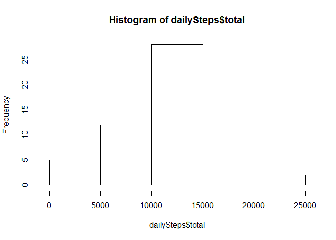
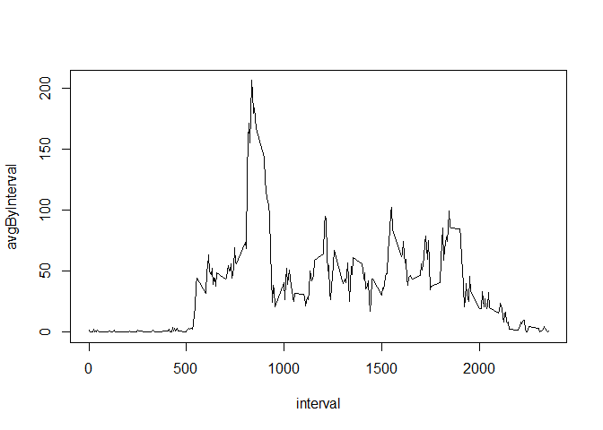
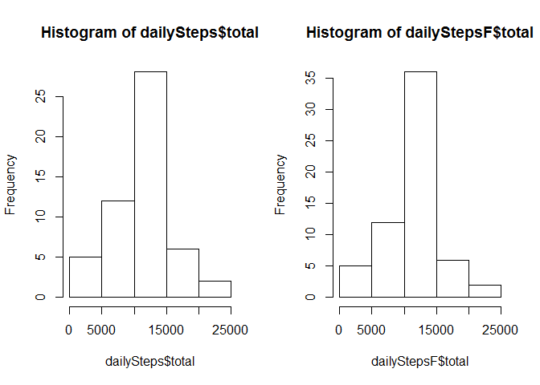
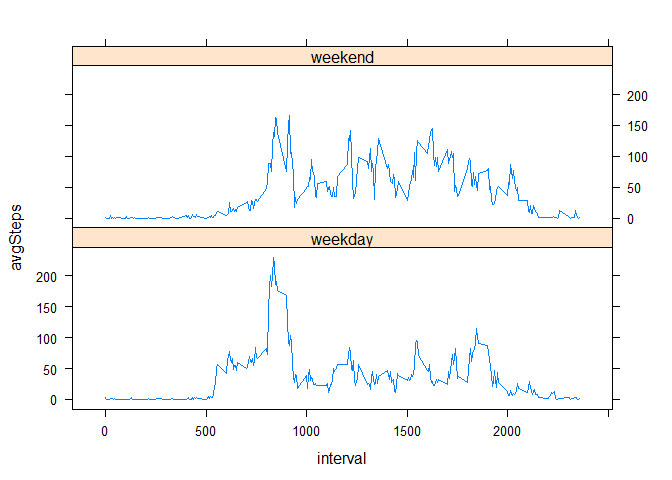

# Reproducible Research Project 1
Julie Steury  
Friday, May 15, 2015  
## Loading and preprocessing the data

```r
fname="./activity/activity.csv"  #set filename for knitr 
# fname="activity.csv"  #set filename
         
# Load libraries
library(lubridate)
```

```
## Warning: package 'lubridate' was built under R version 3.1.3
```

```r
library(dplyr)
```

```
## Warning: package 'dplyr' was built under R version 3.1.3
```

```
## 
## Attaching package: 'dplyr'
## 
## The following objects are masked from 'package:lubridate':
## 
##     intersect, setdiff, union
## 
## The following object is masked from 'package:stats':
## 
##     filter
## 
## The following objects are masked from 'package:base':
## 
##     intersect, setdiff, setequal, union
```

```r
#library(plyr)
par(mfrow=c(1,1))  #initalize graphics device


#Read in data
aData<-read.csv(fname,stringsAsFactors=FALSE)

#  Convert dates from character to POSIXct class
dates<- ymd(aData$date)
aData$date <- dates

#head(aData); str(aData);tail(aData)

aDataTbl = group_by(tbl_df(aData),date)
```


## What is mean total number of steps taken per day?

```r
## What is mean total number of steps taken per day?

save <- summarize(aDataTbl,total=sum(steps))
dailySteps <- summarize(aDataTbl,total=sum(steps))
dailyMean <- summarize(aDataTbl,avgDayStep=mean(steps))

allMean <- mean(dailyMean$avgDayStep)
periodMean=mean(dailySteps$total,na.rm=TRUE)
periodMedian = median(dailySteps$total,na.rm=TRUE)
periodMean;periodMedian
```

```
## [1] 10766.19
```

```
## [1] 10765
```

```r
# make a histogrm of daily steps
hist(dailySteps$total)
```

 


## What is the average daily activity pattern?


```r
#Clean up missing data 
aDataInt = group_by(tbl_df(aData),interval)

idx=!is.na(aDataInt$steps)
aDataInt=aDataInt[idx,]

intervalMean = summarize(aDataInt,avgByInterval=mean(steps))
```

Create the plot - time interval vs. average by interval 

 

Note that the `echo = FALSE` parameter was added to the code chunk to prevent printing of the R code that generated the plot.

Find the interval with the maximum average steps.

```r
max=max(intervalMean[[2]])
y=intervalMean[which(intervalMean$avgByInterval==max),]
intervalMax=y[[1]]
intervalMax
```

```
## [1] 835
```

## Imputing missing values
Devise a strategy for filling in all of the missing values in the dataset. The strategy does not need to be sophisticated. For example, you could use the mean/median for that day, or the mean for that 5-minute interval, etc.

Create a new dataset that is equal to the original dataset but with the missing data filled in.

```r
colSums(is.na(aData))
```

```
##    steps     date interval 
##     2304        0        0
```

```r
sum(is.na(aData$steps))
```

```
## [1] 2304
```


```r
idx=which(is.na(aData$steps))  #find the indexes for the na values

aDataF <- aData

for(i in seq_along(idx)) {
        intrv = aDataF[idx[i],]$interval
        x=which(intervalMean$interval==intrv)
        aDataF[idx[i],]$steps = intervalMean[x,]$avgByInterval
#%ry subbing in 10000 and see how results change
}

mean(aData$steps)
```

```
## [1] NA
```

```r
mean(aDataF$steps)
```

```
## [1] 37.3826
```

## Are there differences in activity patterns between weekdays and weekends?


```r
aDataFTbl = group_by(tbl_df(aDataF),date)
dailyStepsF <- summarize(aDataFTbl,total=sum(steps))
periodMeanF <- mean(dailyStepsF$total)
periodMedianF <-median(dailyStepsF$total)
periodMeanF
```

```
## [1] 10766.19
```

```r
periodMedianF
```

```
## [1] 10766.19
```

```r
# make a new histogrm of daily steps with missing data "filled"; compare to original
par(mfrow=c(1,2))
hist(dailySteps$total)
hist(dailyStepsF$total)
```

 

## Panel plot weekday and weekend days

Make a panel plot containing a time series plot (i.e. type = "l") of the 5-minute interval (x-axis) and the average number of steps taken, averaged across all weekday days or weekend days (y-axis). See the README file in the GitHub repository to see an example of what this plot should look like using simulated data.


```r
temp <- mutate(aDataF,wkDay=weekdays(date))
temp <- ifelse (temp$wkDay %in% c('Sunday','Saturday'),"weekend","weekday")
aDataF$wkDay <- as.factor(temp) 
```


```r
# Group by wkday type and interval
by_interval <- group_by(tbl_df(aDataF), interval,wkDay)
avgSteps=summarize(by_interval,avgSteps=mean(steps))

library(lattice)
```

```
## Warning: package 'lattice' was built under R version 3.1.3
```

```r
xyplot(avgSteps~interval | wkDay,data=avgSteps, layout=c(1,2), type="l")
```

 

```r
#par=par(mfrow=c(2,1))
#with(avgSteps,plot(interval,avgSteps,type="l"))
```


Debugging code - ignore


```r
#summaryT=cbind(dailySteps,dailyMean,dailyStepsF,dailyMeanF)
#head(summaryT)
#tail(summaryT)
```


